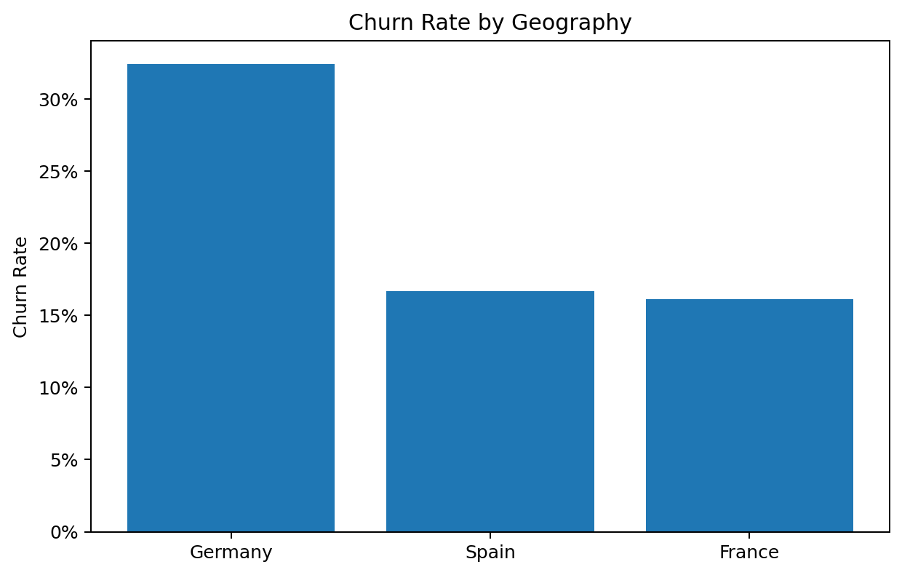
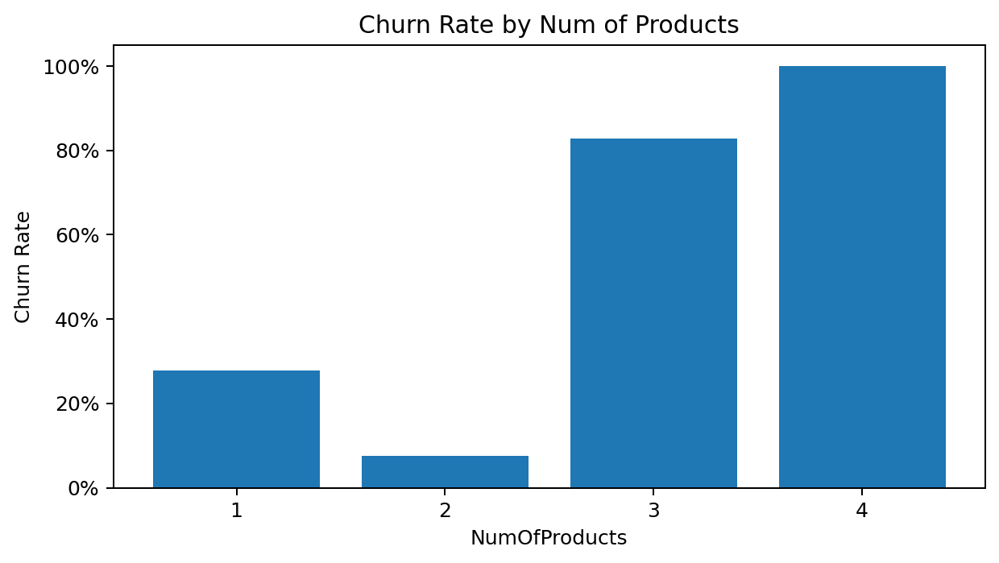
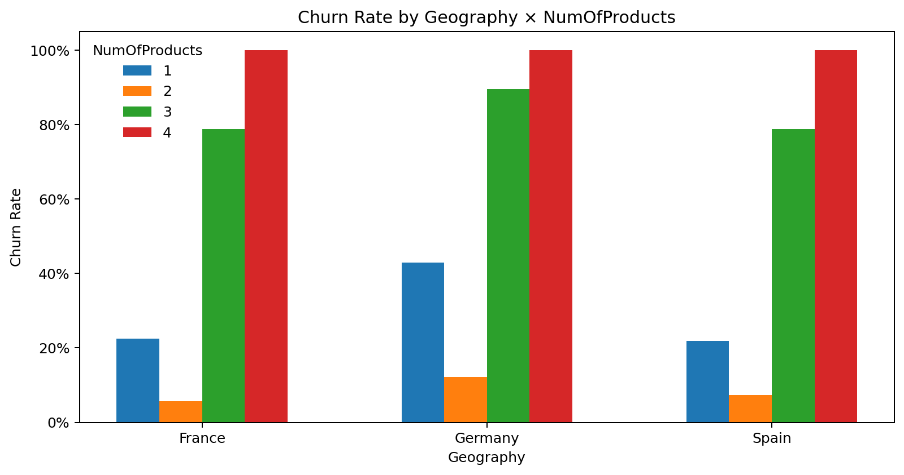
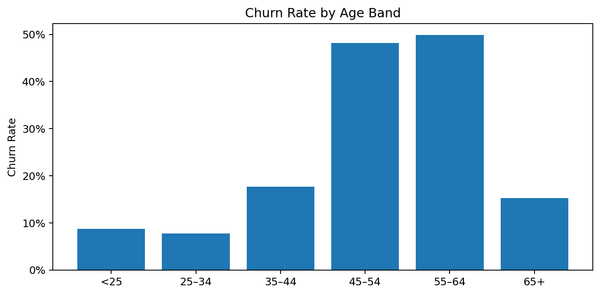
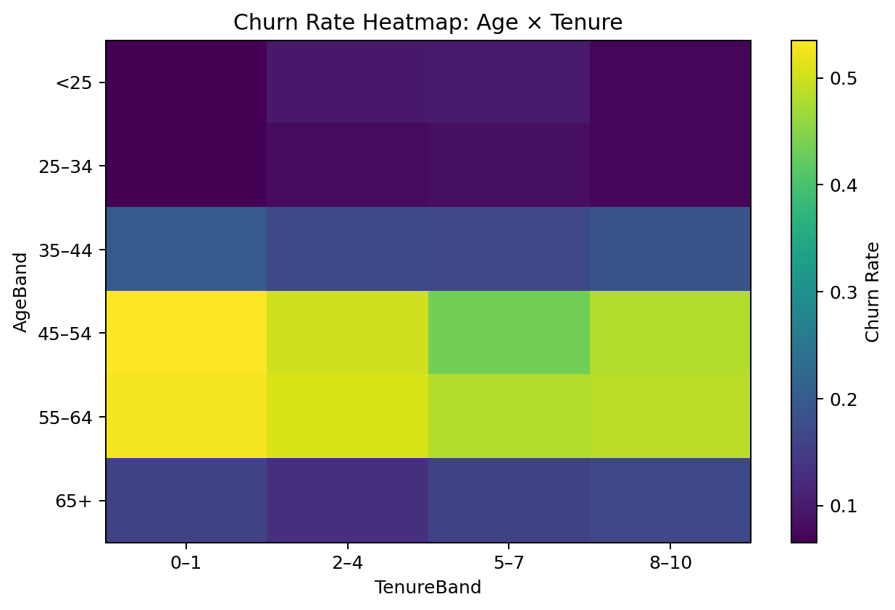
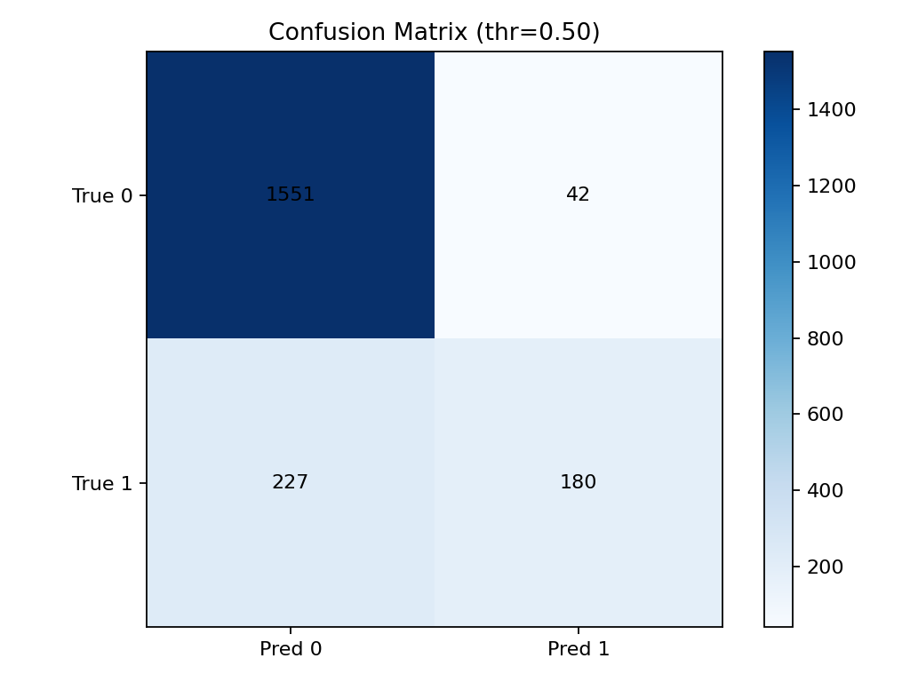
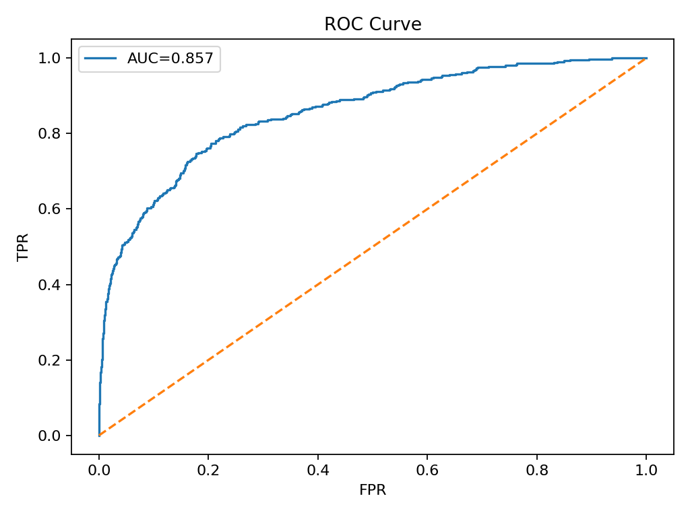

# End-to-End Customer Churn Analytics & Prediction Pipeline

**Date:** February 6, 2026

---

## 📂 System Modules & Architecture

Although hosted in a unified repository, the system is architected into distinct functional modules to mimic an enterprise microservices pattern.

| Module | Purpose | Tech Stack |
| :--- | :--- | :--- |
| **`src/data`** | **ETL & Data Engineering.** Ingests raw CSV data, loads it into a transactional database (SQLite), and standardizes formats using SQL Views. | Python, SQLite3, SQL |
| **`src/models`** | **Machine Learning Engine.** Handles training, hyperparameter tuning (GridSearch), and serialization of the Random Forest classifier. | Scikit-Learn, Joblib |
| **`src/viz`** | **Reporting Layer.** Generates automated business intelligence visualizations and performance metrics. | Matplotlib, Seaborn |
| **`reports/`** | **Artifact Store.** Holds the output of the pipeline: static assets, charts, and executive summaries. | PNG, CSV |

---

## 👥 Project Team Structure (Simulated)

**Project Leadership**
* **Lead Analytics Engineer:** Emily Huynh

**Engineering Functions**
* **Data Engineer:** Implemented the SQLite Data Warehouse pattern and SQL Views.
* **Data Scientist:** Developed the Random Forest model and optimized threshold tuning.
* **Business Analyst:** Interpreted model feature importance into actionable retention strategies.

---

## 1. Executive Summary: The "Capital at Risk"

This initiative transitions the organization from **reactive churn reporting** to **proactive risk mitigation**. By implementing a modular Machine Learning pipeline, we have successfully modeled customer attrition behavior with a high degree of reliability (**ROC-AUC ~0.86**).

The analysis reveals that churn is not a random event but a structural issue driven by three specific friction points:
1.  **Market Failure in Germany:** A systemic regional issue causing ~2x higher churn rates.
2.  **The "Single-Product" Vulnerability:** Customers with low ecosystem entanglement (1 product) are **400% more likely to leave** than those with 2 products.
3.  **The "Middle-Age" Exodus:** High-net-worth customers aged 45-60 are exiting at alarming rates.

**Strategic Imperative:** Implementing this model allows us to identify **~75% of at-risk capital** before it leaves the bank, enabling a targeted retention strategy that optimizes marketing spend.

---

## 2. Technical Architecture & Data Governance

### 2.1 Extraction & Storage Layer (ETL)
We implemented a **"Lakehouse" pattern** using SQLite to simulate a production Data Warehouse.
* **Immutability:** Raw data is ingested but never modified. All transformations occur via SQL Views.
* **Consistency:** Business logic for "Age Banding" is centralized in SQL.
    * *Code Snippet:* `src/data/make_dataset.py` creates `v_customers_banded`.

### 2.2 The Modeling Engine
* **Preprocessing:** Utilized `scikit-learn` ColumnTransformers to handle One-Hot Encoding and Scaling within the pipeline object itself. This prevents **data leakage**.
* **Algorithm Selection:**
    * *Baseline:* Logistic Regression (Linear).
    * *Champion:* **Random Forest Classifier**. Selected for its ability to capture non-linear interactions (e.g., "Older customers in Germany").

---

## 3. Comprehensive Market & Segment Analysis

### 3.1 The "German Anomaly" (Geographic Failure)
Our presence in the DACH region (Germany) is facing a critical retention failure.
* **The Data:** Germany exhibits a churn rate of **~32%**, compared to ~16% in France and Spain.
* **Gender Interaction:** The issue is exacerbated by gender. **Female customers in Germany** have the highest attrition rate of any segment (**~37.5%**).



### 3.2 The "One-Product" Trap (Ecosystem Entanglement)
Product holdings are the single strongest predictor of customer loyalty.
* **1 Product (The Danger Zone):** Churn Rate ~27%. These customers have no switching costs.
* **2 Products (The Sweet Spot):** Churn Rate ~7%. These customers are sticky.
* **Insight:** Even in the high-risk German market, customers with 2 products are significantly safer.




### 3.3 Demographic Risk (The Wealth Exodus)
Contrary to the "Loyalty Myth," long-tenured and older customers are **not** safe.
* **The "Mid-Life" Crisis:** Churn risk peaks between ages **45 and 60**. These are typically peak earning years, meaning we are losing our most valuable deposits.
* **Tenure Irrelevance:** As shown in the heatmap below, long tenure (darker squares) does *not* insulate a customer from churning if they fall into the high-risk age group.




---

## 4. Model Performance & Evaluation

We optimized the model to balance **Precision** (Cost Saving) and **Recall** (Revenue Saving).

### 4.1 Confusion Matrix Analysis
* **High Precision (~81%):** When the model predicts a customer will leave, it is highly accurate. This justifies spending budget on expensive retention offers.
* **Moderate Recall (~45%):** At the default threshold, we catch nearly half of all churners with zero human intervention.



### 4.2 Discriminative Power (ROC Curve)
The **ROC-AUC of 0.86** indicates excellent separability. The model effectively ranks customers from "Safe" to "At-Risk," allowing the business to work down the list based on available budget.



---

## 5. Operational Strategy: The "Retention Engine"

Based on the risk profiles identified, we propose a three-tiered intervention strategy.

| Tier | Target Segment | Proposed Intervention | Goal |
| :--- | :--- | :--- | :--- |
| **1. Digital Nudge** | **1-Product Users** | **"The Bundle Bonus"**<br>Automated in-app offer: "Open a Savings Account, get $50." | Move users from "Risk Zone" (1 Prod) to "Safe Zone" (2 Prods). |
| **2. Structural Fix** | **Germany (Females)** | **"Market Audit"**<br>Launch a qualitative survey to identify why German women are leaving. | Fix the core product-market fit issue in the DACH region. |
| **3. White Glove** | **Age 45-60 + High Balance** | **"Relationship Outreach"**<br>Personal call from a Relationship Manager. | Retain high-net-worth capital before it exits to a competitor. |

---

## 6. Areas for Improvement & Future Roadmap

To further improve predictive power and operational capability, the following upgrades are proposed:

### 6.1 Advanced Modeling Architectures
* **Gradient Boosting (XGBoost / LightGBM):**
    * *Why:* These models often outperform Random Forest on tabular data by iteratively correcting errors. They train faster on large datasets.
* **Deep Learning (Neural Networks):**
    * *Why:* A Multi-Layer Perceptron (MLP) could capture highly complex non-linear interactions between "Balance" and "Salary" that tree-based models might miss.

### 6.2 MLOps & Infrastructure
* **Dockerization:** Containerize the training and serving scripts to ensure the environment is identical on any machine.
* **API Serving (FastAPI):** Expose the model as a REST API (`POST /predict`) so the CRM system can request real-time churn scores.
* **Drift Monitoring:** Implement a tool like **EvidentlyAI** to detect if customer behavior changes over time (Data Drift), triggering automatic retraining.

---

## 7. Getting Started

```bash
# Clone the repository
git clone [https://github.com/emilyxxhy/churn-modelling.git](https://github.com/emilyxxhy/churn-modelling.git)

# Install dependencies
pip install -r requirements.txt

# Run the full pipeline
python src/data/load_to_sqlite.py    # 1. Ingest Data
python src/models/train_model.py     # 2. Train Model
python src/viz/export_charts.py      # 3. Generate Reports

```

---

© 2026 Emily Huynh Analytics

```

```
